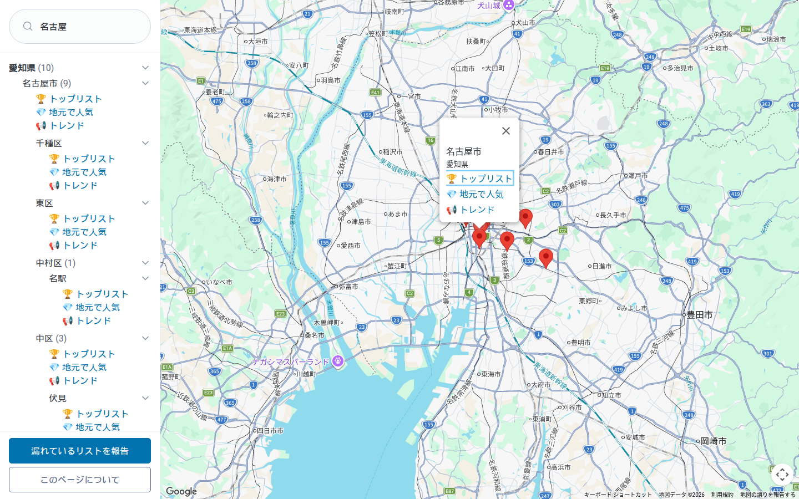
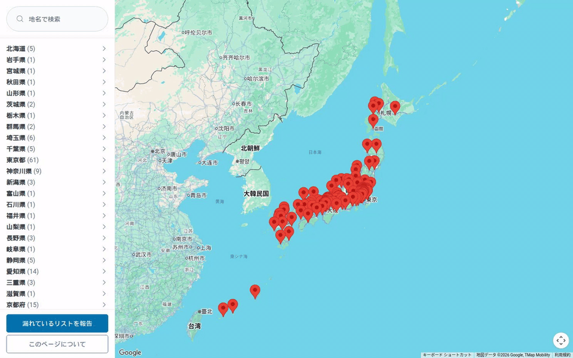
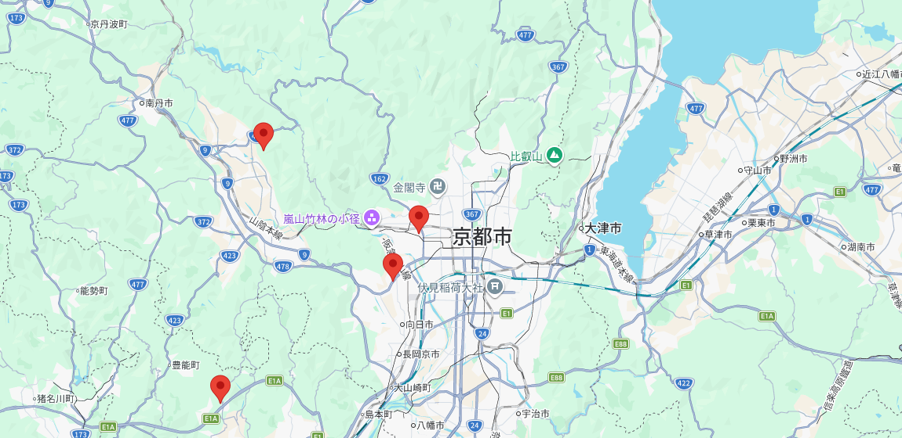
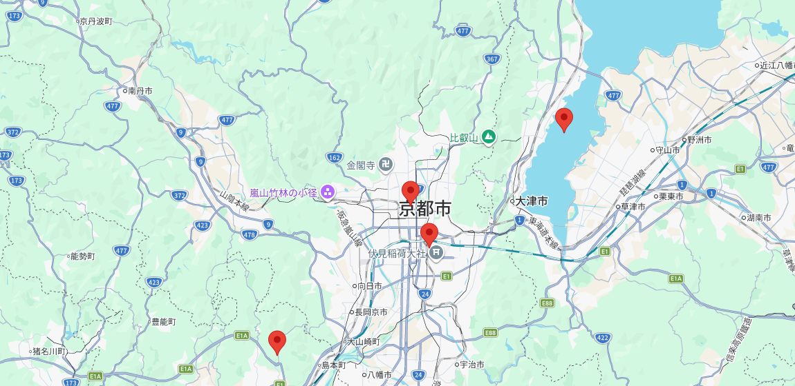

# Google マップの「公式レストランリスト」を地図から探せるようにした話

Google マップには、エリアごとに自動生成される公式のレストランリストがあります。
「[渋谷: トップリスト](https://maps.app.goo.gl/p7w9AfQvL3qqTUNo8)」「[金沢市: 地元で人気](https://maps.app.goo.gl/sKtLGCHEGH53QjFU8)」のような、Google が保持している興味と保存のデータから作られる一覧のことです。

便利なのですが、エリア名を先に知っていないと辿り着けません。
全国にどれだけあるのかを一覧する手段もありません。

そこで、地図のピンから辿れる Web アプリを作りました。

<https://google-maps-restaurant-list-finder-bxnbzgrdda-an.a.run.app>


2026/09/12 現在、200 エリア / 597 リストを収録しています。

ソースコードは GitHub で公開しています。

https://github.com/CRaLFa/google-maps-restaurant-list-finder

## レストランリストとは何か

**レストランリスト**は、Google マップがエリアごとに用意している公式のおすすめレストラン一覧です。
[Google 公式ブログ](https://blog.google/intl/ja-jp/products/explore-get-answers/google-3/) で 2024 年 4 月に発表された機能で、ユーザーが作ったリストではなく、そのエリアで人々が興味を持っている店や保存している店のデータから自動で作られます。

リストには次の 3 種類があります。

- **トップリスト** (Top List)：常に人気の定番店。長年の実績がある店が並ぶ
- **地元で人気** (Gems)：まだあまり知られていない近所の名店
- **トレンド** (Trend)：最近人気が急上昇した店。毎週更新される

ただし、3 種類が揃っていないエリアもあります。
現時点では 200 エリアのうち 3 エリアに トレンド がありません。

アプリでエリア名を検索し、下から出てくるシートを上にスワイプすると表示されます。
リストに載っている店の詳細を開けば、その店が入っているリストへのリンクからも辿れます。

いずれの経路でも、エリア名か掲載店のどちらかを先に知っている必要があります。

## 困っていたこと

私はこのレストランリストを探すのが好きで 460 件ほどフォローしていたのですが、アプリや Web 版の「保存したリスト」や [保存済み](https://www.google.com/interests/saved) ページは表示数に限りがあり、全てを確認することができません。
[Google Takeout](https://takeout.google.com/) でもエクスポートできるのは自分が作成したリストだけで、フォローしたリストの情報は取得できません。

「自分が把握しているエリアおよびリスト」を確認する手段が無かったのです。

そこで、全国の公式レストランリストを自分で収集し、地図から探せる Web アプリを作ることにしました。

## 作ったもの

- 地図のピンをクリックすると、そのエリアにあるリストへのリンクが開く
- 都道府県から市、区、エリア、リストへと降りるツリー。並び順は全国地方公共団体コード順
- 地名のインクリメンタル検索でピンとツリーを同時に絞る (「名古屋」と打てば市内の区が出る)
- 漏れているエリアを報告できるフォーム
- ダークモードとスマートフォン表示に対応

ピンをクリックすると、そのエリアにあるリストへのリンクが吹き出しで開きます。



地名を打つと、ピンとツリーが同時に絞られます。



## 全体構成

| 層 | 選んだもの |
| --- | --- |
| 収集 | Python + adb + uiautomator で実機の Google マップアプリを操作 |
| 座標取得 | 共有 URL を PC の実ブラウザで開いて読む |
| データ | Firestore (Native モード) |
| サーバ | Go / Cloud Run 1 サービス。静的ファイルは `go:embed` でバイナリ 1 個に同梱 |
| フロント | 単一 HTML + Maps JavaScript API + Pico.css |
| スパム対策 | reCAPTCHA Enterprise + サーバ側レート制限 |

以下、収集側から順に見ていきます。

## 収集編 1: 実機を adb で操作する

リストの一覧は API で取得できず、Web 版の Google マップでエリアを検索しても公式レストランリストは出てきません。
残る経路は、Android 実機のアプリを機械的に操作することでした。

手順はこうなります。

1. 「保存済み」画面を `uiautomator dump` で読み、リスト名を全件収集する
2. 各リストを開いて「共有」から「クリップボードにコピー」を叩く
3. 端末のクリップボードを読み、共有 URL を得る
4. Firestore に upsert する

クリップボードの読み取りには [adb-clip](https://github.com/polygraphene/adb-clip) (端末側で動かす小さなヘルパー) を使いました。
`adb shell` からクリップボードを直接読む手段が無いためです。

ここで問題になるのが、コピーが完了したかどうかを知る手段が無いことでした。
タップの直後に読むと、前のリストの URL がそのまま返ってきます。

そこで、コピーを叩く前に番兵の文字列をクリップボードへ置いておき、読み出した値が番兵のままなら失敗と判断するようにしました。

```python
def get_share_url(...):
    clip_write(SENTINEL)
    tap_copy_button()
    time.sleep(WAIT)
    value = clip_read()
    if value == SENTINEL or not value:
        return None, "クリップボードが更新されない"
    return value, None
```

リトライの単位はクリップボードの読み直しではありません。
失敗したリストは待ち行列に戻し、共有シートを開くところからやり直します。
同じリストを試すのは 2 回までとし、それでも取れなければ記録して次へ進みます。

1 件あたり 20 〜 25 秒、約 460 件で 2.5 〜 3 時間かかります。
途中で落ちても Firestore に入った分は飛ばして再開できるようにしました。

## 収集編 2: 座標は curl では取れない

集まった共有 URL には、座標が入っていません。
リストのピンを地図に置くには緯度経度が必要です。

共有 URL を開くと、まず座標を持たない URL にリダイレクトされます。
そこから SPA がデータを読み終え、`history.replaceState` で `@lat,lng,zoom` が URL に付加されます。

つまり座標は、JavaScript が動いた後にしか存在しません。
`curl` で追いかけてもリダイレクト先の URL が取れるだけで、座標は取得できません。

実ブラウザで開き、URL が書き換わるのを待つしかありませんでした。
ここで 2 点引っかかりました。

1 点目は、同一タブで続けて別の URL を開くと、地図が再センタリングされないことがある点です。
毎回 `about:blank` を挟んでから開くようにして回避しました。

2 点目は、座標が 2 段階で変わる点です。
まず既定のセンター (東京駅付近) が入り、その後に実際の中心へ書き換わります。

早く読むと全件が東京駅になってしまいます。
値が安定するまでポーリングしてから確定させました。

## ピンが全部西にずれていた

こうして、当時収集していた 155 エリア分の座標が揃いました。
地図に置いてみるとそれらしい位置に並ぶのですが、どれも街の中心から少し左にずれているように見えました。



左上のピンが大津市です。
琵琶湖どころか京都市すら越えて、30 km 西の山の中に立っていました。

そこで OpenStreetMap の行政境界と突き合わせ、各エリアの座標がその自治体のポリゴンに入っているかを調査したところ、155 件中 153 件が境界の中心より西寄りでした。

西へのずれの中央値は 3.5 km、最大は大津市の 30 km。
34 件はポリゴンの外に出ていました。

ここで効いたのが、ずれの向きが経度だけ揃っていたことです。
南北方向の差は向きも大きさもばらばらで、偏りがありませんでした。

地点そのものを取り違えていたのなら経度の差も向きがばらつくはずで、西へ揃っているということは、原因は場所ではなく座標の作られ方にあると考えられました。

原因は Google マップの左パネルでした。

PC 版の画面は、左に幅 480px のパネルが載り、その下まで地図キャンバスが広がっています。
URL に入る中心座標は、パネルに隠れた部分を含めたキャンバス全体の中心を指します。

利用者が見ている可視領域の中心は、そこから 240px 東にあります。
だから収集した座標は、常にパネルの半分だけ西を指していたわけです。

補正は、そのピクセル差を経度に直せば済みます。
Web メルカトルではタイル 1 枚が 256px なので、ズーム `z` における 1px は `360 / (256 * 2^z)` 度にあたります。

```python
def correct(lat: str, lng: str, zoom: str, panel: int) -> tuple[float, float]:
    deg_per_px = 360.0 / (256.0 * 2.0 ** float(zoom))
    return float(lat), float(lng) + panel / 2 * deg_per_px
```

ズームが浅いエリアほど 1px の重みが大きくなります。
大津市の 30 km は、広域表示で拾われたために生じていました。

補正後に同じ検証をかけると、境界外は 34 件から 0 件になりました。
経度差の中央値は 3.5 km から 27 m に縮みました。



同じ範囲を補正後に撮り直したものです。
大津市は琵琶湖の西岸へ、京都市は市街の上へ戻りました。

## フロントの割り切り

ビルド工程を持たない単一 HTML にしました。
ツリーの開閉は `details` / `summary`、報告フォームは `dialog` に任せました。
書いた JavaScript は `showModal()` と `close()` の呼び出しと、背面のクリックで閉じる 1 行だけです。
オーバーレイの描画も、フォーカスをダイアログ内に閉じ込めるのも、Esc で閉じるのもブラウザがやってくれます。

ツリーの階層は、データモデルを変えずに作りました。
各エリアは所在地とエリア名を持っているので、そのフルパスから都道府県、市、区の階層を機械的に導いています。

都道府県と市区町村の並び順には、総務省の全国地方公共団体コードを使いました。
1,965 行の対応表を 1 ファイルに置き、Go とフロントの両方がそれを読みます。

[マーカークラスタリング](https://developers.google.com/maps/documentation/javascript/marker-clustering) は、ズームで十分と判断し導入しませんでした。

## まとめ

Google マップの公式レストランリストを地図またはエリアから探せる Web アプリを作成しました。

<https://google-maps-restaurant-list-finder-bxnbzgrdda-an.a.run.app>

漏れているエリアを見つけましたら、アプリ内の報告フォームから報告していただけると嬉しいです。
